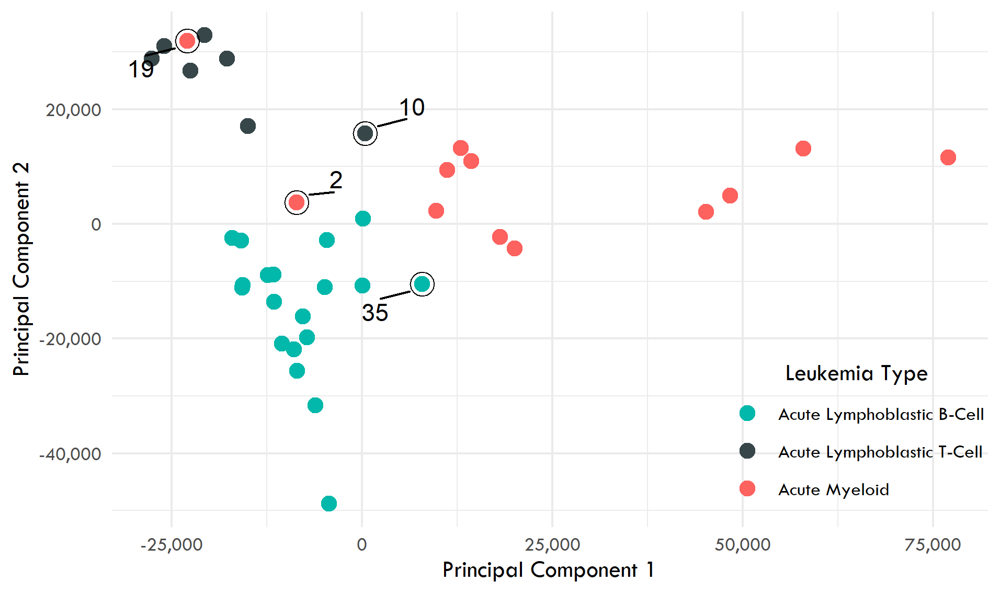

# Principal Component Analysis of Gene Expression Data

In this project, I have analysed gene expressions from 53 samples of DNA for leukemia research. The data contains 37 labelled samples from patients with 3 different types of Leukemia. The remaining 16 samples were unlabelled.

The three types of Leukemia mentioned in the data are:
- AML (Acute Myeloid)
- ALL-B (Acute Lymphoblastic B-Cell)
- ALL-T (Acute Lymphoblastic T-Cell)

The data contains 5000 variables and I performed Principal Component Analysis (PCA) to reduce its dimension size. The top two principal components (PCs) explained about 36% of the variation in the data. It took 20 PCs to explain 90% variation in the data.

I visualized the data using a scatter plot of their scores from the first two principal components and coloured the points as per the corresponding Leukemia type:

The three types of Leukemia seem to have distinct clusters based on the principal components. However, it appears that sample IDs 2, 10, 19 and 35 are anomalies. More specifically, they appear to be in the cluster of a Leukemia type which is different from their assigned labels. One possible explanation could be misassignment of labels for these IDs and should be investigated further.